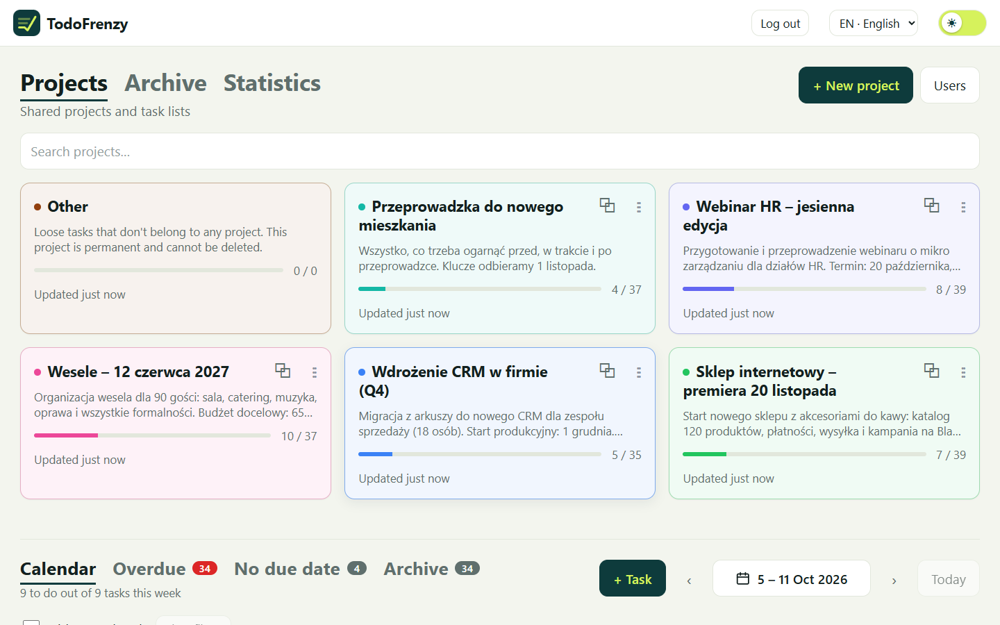
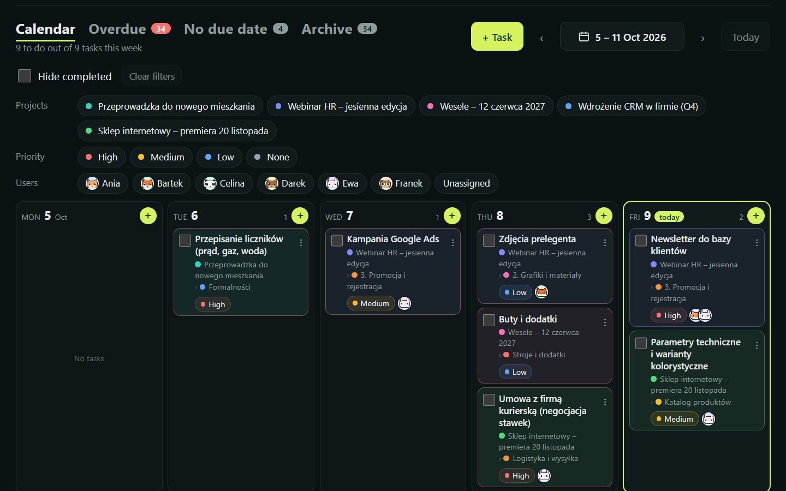
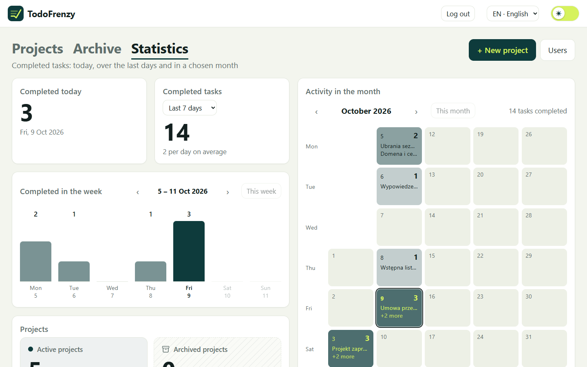

# TodoFrenzy

**English** · [Polski](README.pl.md)

A shared, self-hosted web app for managing **projects, lists and tasks**, with a calendar, an overdue view and statistics.
It runs on your local network (a computer plus phones), behind a login with **one shared account**. Changes show up for everyone
live (WebSocket). Data is stored in SQLite — a single file, no external database server. The interface is bilingual: **English and Polish**.



<p>
  
  
</p>

## Features

- **Projects → lists → tasks**, all reorderable by drag and drop, with colors, copying and progress counters.
- **A permanent "Other" project** with a single "Tasks" list for loose tasks; it cannot be deleted.
- **Weekly calendar**: tasks with due dates, filters, hiding completed tasks, rescheduling by dragging, adding tasks to a given day.
- **Overdue**, **No due date** and **Archive** — card grids with filters, sorting, quick rescheduling, restoring and pagination.
- **Project archive** — an archived project leaves the list and its tasks leave the calendar; restoring a task restores the whole project.
- **Statistics** — completed today and over recent days, a weekly chart, a GitHub-style activity map and a project summary.
- **Users with pixel-art avatars** assigned to tasks, **tags** on lists, **priorities**, **light and dark themes**.
- **Realtime** updates, a mobile-first layout, two list layouts (grid / slider), **EN / PL** interface.

Full description: [docs/FEATURES.md](docs/FEATURES.md).

## Requirements

- **Node.js ≥ 22** (the npm that ships with it is enough: Node 22 → npm 10, Node 24 → npm 11). Nothing else — SQLite is embedded (the native `better-sqlite3` module downloads a prebuilt binary or compiles during `npm install`).

## Quick start

```bash
git clone https://github.com/infobotsteven/TodoFrenzy.git
cd TodoFrenzy
npm install
npm run dev              # backend :3000 + frontend :5173 (with hot reload)
```

Open http://localhost:5173 and log in with **`admin` / `admin`** (the default credentials — **change them**, see below).
Database migrations are applied automatically on server start and the database file is created at `data/todo.db`. Configuration lives in a `.env` file
(copy the template: `cp .env.example .env` in Git Bash/Linux/macOS, `Copy-Item .env.example .env` in PowerShell) — without it, sensible defaults apply.

Demo data (in Polish): `npm run seed:demo` (against a running dev server).

### Login and changing the password

The app requires a login (one shared account; several people can be logged in at once, a session lasts 7 days from the last activity). The account is configured in `.env`, not in the database:

```bash
npm run auth:hash -- "yourNewPassword"      # prints an AUTH_PASSWORD_HASH='...' line
```

Paste that line into `.env` (optionally also `AUTH_USER=...`) and restart the server — changing it **logs everyone out**. With no settings, `admin`/`admin` applies (the server warns in its log).
After 5 failed attempts from one address, login is blocked for 15 minutes. Details: [docs/SECURITY.md](docs/SECURITY.md).

### Production build (one process, one port)

```bash
npm run build
npm start                # Fastify serves the API and the built frontend on :3000
```

Then open http://localhost:3000.

### Docker (home server)

The easiest way to run TodoFrenzy permanently on a home server (Windows with Docker Desktop, Linux or a NAS). Requires Docker with Compose v2.24 or newer (current Docker Desktop is fine).

You do not need Node.js or npm on the server for this — the image brings its own. Run the commands in any folder you like (the clone creates a `TodoFrenzy` folder there), in PowerShell, Git Bash or any other shell.

```bash
git clone https://github.com/infobotsteven/TodoFrenzy.git
cd TodoFrenzy
```

Create your settings file from the template — **one** of these, depending on the shell:

```bash
cp .env.example .env              # Git Bash, Linux, macOS
```
```powershell
Copy-Item .env.example .env       # PowerShell
```

1. **Build and start it:**
   ```bash
   docker compose up -d --build
   ```
   The first build takes a few minutes. Check it with `docker compose ps` (the state should become `healthy`) and `docker compose logs`. At this point the app already works with the default login `admin` / `admin`.
2. **Open it:** `http://<server-IP>:3100` from any device on your network, and log in. (Find the server's IP with `ipconfig` on Windows or `hostname -I` on Linux.)
3. **Set your own password** (do this before anyone else uses the app):
   ```bash
   docker compose run --rm app node server/dist/auth-hash-cli.js 'yourPassword'
   ```
   Put the password in single quotes so the shell does not interpret special characters. The command prints a line `AUTH_PASSWORD_HASH='...'` — paste it, with the quotes, into `.env` (do **not** uncomment the example line with the dots, add your real one). Then apply it with `docker compose up -d`. The old `admin`/`admin` login stops working and everyone is logged out.
4. **Optional: another port.** The app listens on host port **3100** by default (so it does not clash with something already using 3000). To change it, uncomment and edit `TODOFRENZY_PORT=3100` in `.env`, then run `docker compose up -d`. Nothing else in `.env` needs changing for Docker (`HOST`, `PORT` and `DATABASE_PATH` are set by `docker-compose.yml`).
5. **Windows only:** allow the port in the firewall once (PowerShell as administrator; use your port if you changed it):
   ```powershell
   New-NetFirewallRule -DisplayName "TodoFrenzy" -Direction Inbound -Protocol TCP -LocalPort 3100 -Profile Private -Action Allow
   ```
   Also reserve a fixed IP address for the server in your router, and turn on *Start Docker Desktop when you sign in* so the container comes back after a reboot (`restart: unless-stopped` does the rest).

How the data is stored:
- The database lives in the Docker volume `todofrenzy_data` (inside the container: `/app/data/todo.db`) and survives restarts, rebuilds and updates. A Docker-managed volume is used on purpose: SQLite in WAL mode is unreliable on Windows host folders. The file is not visible in Explorer; to get it out, make a backup (below).
- The data is lost **only** if you delete the volume: `docker compose down -v`, removing `todofrenzy_data` in Docker Desktop (*Volumes*), `docker system prune --volumes`, or resetting/uninstalling Docker Desktop. Plain `docker compose down` / `stop` / `restart` and updates keep it.
- Backups go to the `backups/` folder next to `docker-compose.yml`:
  ```bash
  docker compose exec app node server/dist/backup-cli.js
  ```
  Copy that folder somewhere outside the server now and then (or schedule the command with Task Scheduler / cron). To restore a backup:
  ```bash
  docker compose stop app
  docker compose run --rm --no-deps app sh -c "rm -f /app/data/todo.db-wal /app/data/todo.db-shm && cp /app/backups/todo-YYYYMMDD-HHMMSS.db /app/data/todo.db"
  docker compose start app
  ```
  On Linux the `backups/` folder must be writable by uid 1000 (`mkdir backups && chown 1000:1000 backups`).

Everyday commands:

| Command | What it does |
|---|---|
| `docker compose up -d --build` | start, or update after `git pull` (data is kept) |
| `docker compose logs -f` | follow the log |
| `docker compose restart app` | restart |
| `docker compose down` | stop and remove the container (data stays; do **not** add `-v`, it deletes the volume) |

The same HTTP-only caveat applies as above: use it on your home network, and put a reverse proxy with HTTPS (or a VPN) in front of it before exposing it outside.

### Configuration (`.env`)

| Variable | Default | Meaning |
|---|---|---|
| `HOST` | `0.0.0.0` | listen address (`0.0.0.0` = the whole local network) |
| `PORT` | `3000` | server port |
| `DATABASE_PATH` | `./data/todo.db` | the SQLite file |
| `BACKUP_DIR`, `BACKUP_KEEP` | `./backups`, `14` | backup directory and number of backups kept |
| `AUTH_USER`, `AUTH_PASSWORD_HASH` / `AUTH_PASSWORD` | `admin` / `admin` | login account (a hash is recommended) |
| `AUTH_SESSION_SECONDS`, `AUTH_MAX_ATTEMPTS`, `AUTH_LOCK_SECONDS` | `604800`, `5`, `900` | session lifetime and lockout after failed attempts |
| `TODOFRENZY_PORT` | `3100` | Docker only: the port exposed on the host |

### Access from a phone (local network)

The server listens on `0.0.0.0` and prints its network addresses on start (e.g. `http://192.168.x.x:3000`; in dev mode the frontend is on port `5173`).
Windows blocks incoming connections — run this once in PowerShell as administrator:

```powershell
New-NetFirewallRule -DisplayName "TodoFrenzy" -Direction Inbound -Protocol TCP -LocalPort 3000,5173 -Profile Private -Action Allow
```

It helps to reserve a fixed IP address for the computer in your router so saved links keep working.
On a local network the password and session travel over plain HTTP — **do not expose the app to the internet** without HTTPS (a reverse proxy) and without changing the default password
(see [docs/SECURITY.md](docs/SECURITY.md)).

### Backups

```bash
npm run db:backup        # a consistent copy of the database into backups/ (the 14 newest are kept)
```

## Commands

| Command | What it does |
|---|---|
| `npm run dev` | server (tsx watch) and Vite together |
| `npm run build` / `npm start` | build the frontend and server / run the production build |
| `npm run typecheck` | TypeScript in all packages |
| `npm run lint` | ESLint (TypeScript + React hooks rules) |
| `npm run lint:unused` | knip: dead exports, unused files and dependencies |
| `npm run test:e2e` | build + browser tests on a throwaway instance with a temporary database (needs Edge or Chrome installed, see [docs/TESTING.md](docs/TESTING.md)) |
| `npm run auth:hash -- "password"` | password hash for `.env` (`AUTH_PASSWORD_HASH`) |
| `npm run seed:demo` | loads demo data into a running server |
| `npm run db:generate` | generates a migration after changing `server/src/db/schema.ts` |
| `npm run db:migrate` | applies migrations manually (the server does it on start anyway) |
| `npm run db:backup` | a consistent database copy into `backups/` |

## Repository structure

```text
shared/   Zod schemas, types and constants shared by frontend and backend (the source of truth for the API)
server/   Fastify + SQLite (better-sqlite3) + Drizzle; migrations in server/drizzle
client/   React 19 + Vite + TypeScript (TanStack Query, Zustand, dnd-kit, react-router)
e2e/      browser tests (Playwright) + demo data
docs/     documentation (English in docs/, Polish in docs/pl/)
logo/     the "Odhacz" logo (SVG/PNG)
data/     the SQLite file (created on first run, not in git)
Dockerfile, docker-compose.yml   container image and its run configuration (see "Docker")
```

## Documentation

English documentation is canonical and lives in `docs/`; Polish translations are in `docs/pl/`.

| Document | Contents |
|---|---|
| [FEATURES.md](docs/FEATURES.md) | what the app does, behavior rules, views |
| [ARCHITECTURE.md](docs/ARCHITECTURE.md) | layers, data flow, realtime, state, drag and drop, CSS |
| [DATA-MODEL.md](docs/DATA-MODEL.md) | tables, relations, migrations, conventions |
| [API.md](docs/API.md) | REST endpoints, errors, WebSocket events |
| [DEVELOPMENT.md](docs/DEVELOPMENT.md) | how to work on the code, recipes for common changes, pitfalls |
| [TESTING.md](docs/TESTING.md) | E2E tests: running, data, writing new ones |
| [SECURITY.md](docs/SECURITY.md) | threat model, safeguards, limitations |
| [ROADMAP.md](docs/ROADMAP.md) | open topics and ideas (Docker, authentication…) |

## Notes

- Code comments and the demo data are in Polish (the language the project started in); interface texts have complete EN and PL versions.
- Development happens on the `develop` branch; `main` holds releases (tags `vX.Y.Z`).

## License

[MIT](LICENSE) © 2026 infobotsteven
